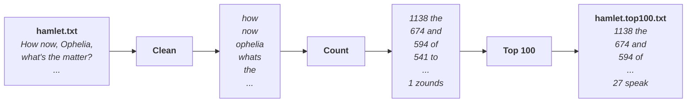

```mermaid
flowchart LR
    input["<b>hamlet.txt</b><br/><i>How now, Ophelia,<br/>what's the matter?<br/>...</i>"]
    clean["<b>Clean</b>"]
    cleaned["<i>how<br/>now<br/>ophelia<br/>whats<br/>the<br/>...</i>"]
    count["<b>Count</b>"]
    counted["<i>1138 the<br/>674 and<br/>594 of<br/>541 to<br/>...<br/>1 zounds</i>"]
    top["<b>Top 100</b>"]
    top100["<b>hamlet.top100.txt</b><br/><i>1138 the<br/>674 and<br/>594 of<br/>...<br/>27 speak</i>"]

    input --> clean --> cleaned --> count --> counted --> top --> top100
```
