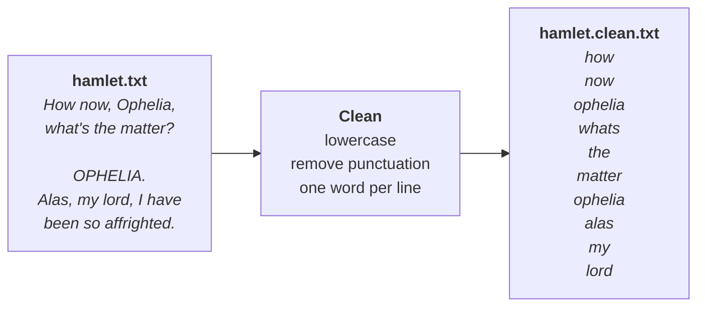

```mermaid
flowchart LR
    input["<b>hamlet.txt</b><br/><i>How now, Ophelia,<br/>what's the matter?<br/><br/>OPHELIA.<br/>Alas, my lord, I have<br/>been so affrighted.</i>"]
    clean["<b>Clean</b><br/>lowercase<br/>remove punctuation<br/>one word per line"]
    output["<b>hamlet.clean.txt</b><br/><i>how<br/>now<br/>ophelia<br/>whats<br/>the<br/>matter<br/>ophelia<br/>alas<br/>my<br/>lord</i>"]

    input --> clean --> output
```
