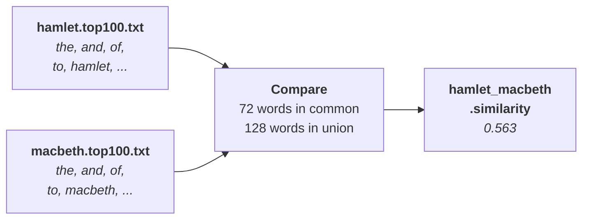

```mermaid
flowchart LR
    h["<b>hamlet.top100.txt</b><br/><i>the, and, of,<br/>to, hamlet, ...</i>"]
    m["<b>macbeth.top100.txt</b><br/><i>the, and, of,<br/>to, macbeth, ...</i>"]
    cmp["<b>Compare</b><br/>72 words in common<br/>128 words in union"]
    result["<b>hamlet_macbeth<br/>.similarity</b><br/><i>0.563</i>"]

    h --> cmp
    m --> cmp
    cmp --> result
```
