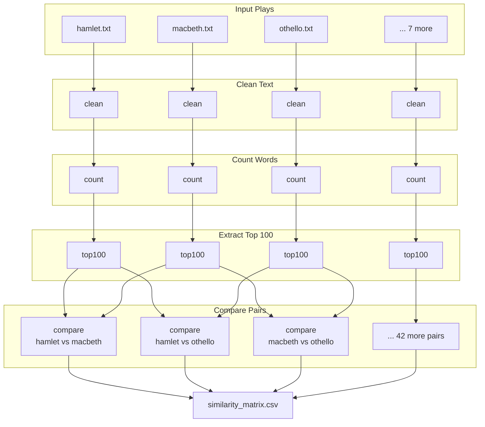

```mermaid
flowchart TD
    subgraph inputs["Input Plays"]
        i1[hamlet.txt]
        i2[macbeth.txt]
        i3[othello.txt]
        i4["... 7 more"]
    end

    subgraph clean["Clean Text"]
        cl1[clean]
        cl2[clean]
        cl3[clean]
        cl4[clean]
    end

    subgraph count["Count Words"]
        co1[count]
        co2[count]
        co3[count]
        co4[count]
    end

    subgraph top["Extract Top 100"]
        t1[top100]
        t2[top100]
        t3[top100]
        t4[top100]
    end

    subgraph compare["Compare Pairs"]
        c1["compare<br/>hamlet vs macbeth"]
        c2["compare<br/>hamlet vs othello"]
        c3["compare<br/>macbeth vs othello"]
        c4["... 42 more pairs"]
    end

    matrix[similarity_matrix.csv]

    i1 --> cl1 --> co1 --> t1
    i2 --> cl2 --> co2 --> t2
    i3 --> cl3 --> co3 --> t3
    i4 --> cl4 --> co4 --> t4

    t1 --> c1
    t2 --> c1
    t1 --> c2
    t3 --> c2
    t2 --> c3
    t3 --> c3
    t4 --> c4

    c1 --> matrix
    c2 --> matrix
    c3 --> matrix
    c4 --> matrix
```
