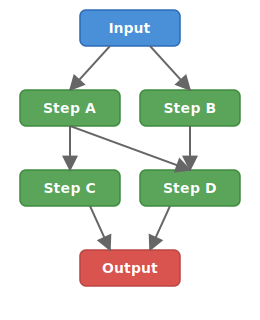
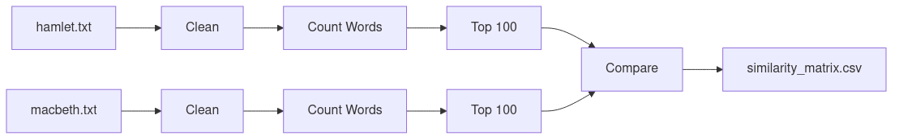
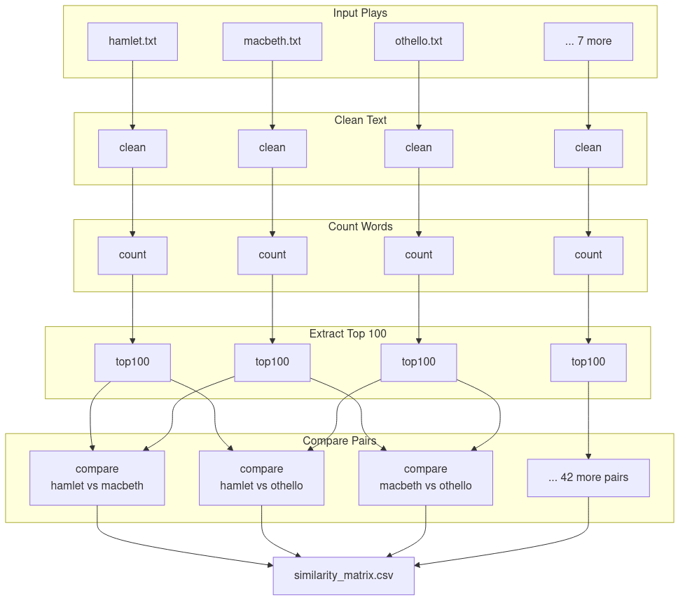

<style>
@import url('https://fonts.googleapis.com/css2?family=Roboto+Slab:wght@400;700&display=swap');
.columns { display: flex; gap: 1em; }
.columns > div { flex: 1; }
section h1, section h2, section h3 { font-family: 'Roboto Slab', serif; }
img[alt~="center"] { display: block; margin: 0 auto; }
header {
  font-family: 'Roboto Slab', serif;
  color: #999;
  font-size: 0.6em;
  width: 100%;
  text-align: right;
  left: 0;
  right: 0;
  padding: 20px 60px 20px 30px;
  box-sizing: border-box;
}
footer {
  font-family: 'Roboto Slab', serif;
  color: #999;
  font-size: 0.6em;
  width: 100%;
  text-align: center;
  left: 0;
  right: 0;
  padding: 0 30px 0px 30px;
  box-sizing: border-box;
}
section::after { font-family: 'Roboto Slab', serif; }
section.lead h1 { font-size: 2.4em; }
section::before {
  content: '';
  background-image: url('images/ycrc-logo-white.png');
  background-size: contain;
  background-repeat: no-repeat;
  position: absolute;
  bottom: 20px;
  left: 30px;
  width: 100px;
  height: 50px;
}
</style>

# Pipelining Tools for HPC Workflows

## Using Bash, Snakemake and Nextflow

Yale Center for Research Computing

---

# Agenda

- **The Problem**: why pipelines?
- **Pipelining concepts**
- **An example workflow**
- **Bash & Slurm**
- **Snakemake**: turning our example into a Snakemake pipeline
- **Nextflow**: using pipelines from the research community
- **Resources**

---

# Setup

Log in to the cluster and clone the workshop repository:

```bash
git clone https://github.com/ycrc/pipelines-workshop.git
cd pipelines-workshop
ls examples/
```

You will need a terminal and a text editor. We recommend an [Open OnDemand](https://ood.ycrc.yale.edu) VS Code session.

---

<!-- _class: lead -->

# The Problem

---

# Your Workflow

<div class="columns">
<div>

- Multiple steps that process input to produce output
- Some steps depend on others completing first
- It works — now you need to run it many times, scale it up, or share it

</div>
<div>

```bash
# step 1: process raw data
./clean.sh raw.dat > clean.dat

# step 2: run analysis
./analyze.sh clean.dat > results.dat

# step 3: make figures
./plot.sh results.dat > fig.png
```

</div>
</div>

---

# What Can Go Wrong

- Script versions multiply
- Data folders accumulate
- "It worked on my machine"
- A step fails halfway — is the output valid?

---

# Today's Learning Goals

- Understand key concepts for constructing data pipelines
- Build a simple workflow using bash scripts and Slurm
- Translate that workflow into a Snakemake pipeline
- Run a community-maintained pipeline using Nextflow and nf-core
---

<!-- _class: lead -->

# Pipelining Concepts

---

<!-- #TODO: Add more examples of DAG diagrams, "this is a DAG" "this is not" etc. -->

# Flowcharts and DAGs

<div class="columns">
<div>

- A workflow is a **directed acyclic graph** (DAG)
- Nodes are tasks, edges are dependencies
- No cycles — a task can't depend on its own output

</div>
<div>



</div>
</div>

---

# Atomicity

- Every step of a pipeline should be **atomic**: it either fully succeeds, or fully fails.
- If a step fails, it should not produce partial output
- Prevents downstream steps from running on bad data

---

# Reproducibility

- **Same input** + **same options** = **same output**
- Portable: works the same on any system
- Version control your pipeline, not just your analysis
- Pipelining tools have features to log exactly what processing was run in what order, with what parameters.

---


<!-- _class: lead -->

# Our Example Workflow

---

# The Input Data

- 10 plays by William Shakespeare
- UTF-8 plaintext files
- Stand-in for your real data: genomic reads, simulation output, etc.
- Small enough to run in a workshop, but the tools scale

# The Goal

- Compute a measure of similarity between each pair of plays based on their most common words.
---

# The Workflow

1. **Clean** each play (lowercase, remove punctuation)
2. **Count** word frequencies
3. **Extract** top 100 words per play
4. **Compare** every pair of plays (Jaccard similarity)
5. **Combine** into a similarity matrix CSV

---

# The DAG (Simplified)

For two plays, the workflow looks like this:



---

# The DAG (Full)

With all 10 plays, the DAG fans out — 45 compare steps:




---

# The Bash Scripts

Our original scripts are found in the workshop repository under `examples/bash/`: 

| Script                  | Purpose                                  |
| ----------------------- | ---------------------------------------- |
| `01_analyze_play.sh`    | Clean text, count words, extract top 100 |
| `02_compare_plays.sh`   | Jaccard similarity between two plays     |
| `03_combine_results.sh` | Aggregate results into CSV               |
| `00_run_all.sh`         | Run everything in order                  |

---

# 01_analyze_play.sh — Overview

Takes one play name as input, produces its top 100 words.

```bash
# Usage: ./analyze_play.sh <play>

PLAY="$1"
INPUT="data/${PLAY}.txt"
```

Three steps: **clean** → **count** → **extract top 100**

---

# 01 — Step 1: Clean the Text

Convert to lowercase, remove punctuation, one word per line:

```bash
cat "$INPUT" \
    | tr '[:upper:]' '[:lower:]' \
    | tr -d '[:punct:]' \
    | tr -s '[:space:]' '\n' \
    > output/${PLAY}.clean.txt
```

- `tr '[:upper:]' '[:lower:]'` — lowercase everything
- `tr -d '[:punct:]'` — delete punctuation
- `tr -s '[:space:]' '\n'` — squeeze whitespace, one word per line

---

# 01 — Step 2: Count Word Frequencies

Sort words, count unique occurrences, sort by frequency:

```bash
cat output/${PLAY}.clean.txt \
    | sort \
    | uniq -c \
    | sort -rn \
    > output/${PLAY}.counts.txt
```

Output looks like:

```
   1138 the
    674 and
    594 of
    ...
```

---

# 01 — Step 3: Extract Top 100

Keep only the 100 most frequent words, clean up intermediates:

```bash
head -100 output/${PLAY}.counts.txt > output/${PLAY}.top100.txt

rm output/${PLAY}.clean.txt
rm output/${PLAY}.counts.txt
```

- `data/hamlet.txt` → `output/hamlet.top100.txt`
- Intermediate `.clean.txt` and `.counts.txt` are deleted

---

# 02_compare_plays.sh — Overview

Takes two play names, computes their **Jaccard similarity**.

```bash
PLAY1="$1"
PLAY2="$2"
FILE1="output/${PLAY1}.top100.txt"
FILE2="output/${PLAY2}.top100.txt"
```

Jaccard = |intersection| / |union| of their top-100 word sets.

---

# 02 — Step 1: Extract Word Lists

Strip the count column, keep just the words:

```bash
awk '{print $2}' "$FILE1" > output/${PLAY1}.words.txt
awk '{print $2}' "$FILE2" > output/${PLAY2}.words.txt
```

---

# 02 — Step 2: Find Common Words

Use `comm` to find the intersection of sorted word lists:

```bash
comm -12 \
    <(sort output/${PLAY1}.words.txt) \
    <(sort output/${PLAY2}.words.txt) \
    > output/common.txt
```

- `comm -12` suppresses lines unique to either file
- Only lines common to **both** files are kept

---

# 02 — Step 3: Calculate Jaccard Similarity

```bash
COMMON=$(wc -l < output/common.txt)
TOTAL1=$(wc -l < output/${PLAY1}.words.txt)
TOTAL2=$(wc -l < output/${PLAY2}.words.txt)

UNION=$((TOTAL1 + TOTAL2 - COMMON))
SIMILARITY=$(echo "scale=3; $COMMON / $UNION" | bc)

echo "${SIMILARITY}" > output/${PLAY1}_${PLAY2}.similarity
```

- `bc` handles decimal division (bash only does integers)
- Output: a single file like `output/hamlet_macbeth.similarity`

---

# 03_combine_results.sh

Loop through all `.similarity` files, build a CSV:

```bash
echo "play1,play2,similarity" > output/similarity_matrix.csv

for file in output/*.similarity; do
    basename=$(basename "$file" .similarity)
    play1=$(echo "$basename" | cut -d'_' -f1)
    play2=$(echo "$basename" | cut -d'_' -f2-)
    similarity=$(cat "$file")

    echo "${play1},${play2},${similarity}" \
        >> output/similarity_matrix.csv
done
```

- Parses play names from the filename
- Final output: `output/similarity_matrix.csv`

---

# 00_run_all.sh — The Orchestrator

```bash
# Step 1: Analyze all plays
for play in data/*.txt; do
    name=$(basename "$play" .txt)
    ./analyze_play.sh "$name"
done

# Step 2: Compare all pairs
plays=(data/*.txt)
for ((i=0; i<${#plays[@]}; i++)); do
    for ((j=i+1; j<${#plays[@]}; j++)); do
        ./compare_plays.sh "$name1" "$name2"
    done
done

# Step 3: Combine results
./combine_results.sh
```

---

# What's Wrong With This?

- Runs everything **serially** — no parallelism
- No **dependency tracking** — if one step fails, downstream runs anyway
- No **checkpointing** — must restart from scratch on failure
- **Manual cleanup** of intermediate files

---

# Moving to Slurm

- Add `#SBATCH` directives for resources
- Add email notifications
- But still a single serial job — no parallelism

---

# Hands-On: Bash + Slurm

- Adapt `00_run_all.sh` to run as a Slurm job
- Add resource directives and email notification
- Submit and check the output

---

<!-- _class: lead -->

# Snakemake

---

# What is Snakemake?

- Python-based workflow management tool
- Define **rules** with inputs, outputs, and commands that produce output from input.
- Snakemake builds the DAG and runs tasks in the right order.
- Snakemake allows you to run shell code, or Python code in your scripts.

---

# Key Concepts

- **Snakefile**: The main file that defines the workflow
- **Rules**: Define a single step in the pipeline
  - Has an `input`, `output`, and a `shell` element.
- **Wildcards**: Create input lists from filename patterns

---

# The Default Target: `rule all`

Snakemake works **backwards** from a target. `rule all` declares what the pipeline should produce:

```python
rule all:
    input:
        "output/similarity_matrix.csv"
```

- This is always the **first rule** in the Snakefile
- Snakemake traces dependencies backwards to figure out what needs to run
- Nothing runs unless it's needed to produce this target

---

# Translating: Clean Text

<div class="columns">
<div>

**Bash**

```bash
cat "$INPUT" \
  | tr '[:upper:]' '[:lower:]' \
  | tr -d '[:punct:]' \
  | tr -s '[:space:]' '\n' \
  > output/${PLAY}.clean.txt
```

</div>
<div>

**Snakemake**

```python
rule clean_text:
    input:
        DATA_DIR + "/{play}.txt"
    output:
        temp("output/{play}.clean.txt")
    shell:
        """
        cat {input} \
          | tr '[:upper:]' '[:lower:]' \
          | tr -d '[:punct:]' \
          | tr -s '[:space:]' '\\n' \
          > {output}
        """
```

</div>
</div>

- `{play}` is a **wildcard** — one rule handles all 10 plays
- `temp()` marks the file for automatic cleanup

---

# Translating: Count Words

<div class="columns">
<div>

**Bash**

```bash
cat output/${PLAY}.clean.txt \
  | sort \
  | uniq -c \
  | sort -rn \
  > output/${PLAY}.counts.txt
```

</div>
<div>

**Snakemake**

```python
rule count_words:
    input:
        "output/{play}.clean.txt"
    output:
        temp("output/{play}.counts.txt")
    shell:
        """
        sort {input} \
          | uniq -c \
          | sort -rn > {output}
        """
```

</div>
</div>

- Snakemake knows `count_words` depends on `clean_text` because the **output of one matches the input of the other**

---

# Translating: Top 100 Words

<div class="columns">
<div>

**Bash**

```bash
head -100 \
  output/${PLAY}.counts.txt \
  > output/${PLAY}.top100.txt

rm output/${PLAY}.clean.txt
rm output/${PLAY}.counts.txt
```

</div>
<div>

**Snakemake**

```python
rule top_words:
    input:
        "output/{play}.counts.txt"
    output:
        "output/{play}.top100.txt"
    shell:
        """
        head -100 {input} > {output}
        """
```

</div>
</div>

- No manual `rm` needed — `temp()` files are cleaned up automatically
- This output is **not** `temp()` because downstream rules depend on it

---

# Translating: Compare Plays

<div class="columns">
<div>

**Bash**

```bash
comm -12 \
  <(awk '{print $2}' "$FILE1" \
    | sort) \
  <(awk '{print $2}' "$FILE2" \
    | sort) \
  > output/common.txt
# ... compute Jaccard ...
```

</div>
<div>

**Snakemake**

```python
rule compare_plays:
    input:
        top1="output/{play1}.top100.txt",
        top2="output/{play2}.top100.txt"
    output:
        "output/{play1}_{play2}.similarity"
    shell:
        """
        COMMON=$(comm -12 \
          <(awk '{{print $2}}' \
            {input.top1} | sort) \
          <(awk '{{print $2}}' \
            {input.top2} | sort) \
          | wc -l)
        ...
        """
```

</div>
</div>

- Two wildcards `{play1}` and `{play2}` handle all 45 pairs

---

# Translating: Combine Results

<div class="columns">
<div>

**Bash**

```bash
echo "play1,play2,similarity" \
  > output/similarity_matrix.csv

for file in output/*.similarity; do
  # parse filename, append CSV row
done
```

</div>
<div>

**Snakemake**

```python
rule combine_results:
    input:
        expand(
          "output/{p1}_{p2}.similarity",
          zip, p1=PLAY1S, p2=PLAY2S)
    output:
        "output/similarity_matrix.csv"
    shell:
        """
        echo "play1,play2,similarity" \
          > {output}
        for file in {input}; do
          # parse filename, append row
        done
        """
```

</div>
</div>

- `expand()` with `zip` generates all 45 input files

---

# Running Snakemake
When executing `snakemake`, it will find a `Snakefile` in the current directory.
- `snakemake -n` for a dry run
- `snakemake` to execute the pipeline
- `snakemake --dag | dot -Tpng > dag.png` to visualize

---

# What You Get for Free

- Automatic dependency resolution
- Only re-runs steps whose inputs changed
- Parallel (multiple processes) execution with `-j`
- DAG visualization
- Dry-run mode

---

# Snakemake on Slurm

- Cluster profile or `--executor slurm`
- Each rule becomes a separate Slurm job
- Snakemake monitors and schedules automatically

---

<!-- #TODO: Add section in Snakemake on how to run python code, R code, existing scripts, matlab script, etc. -->
<!-- #TODO: Add section in Snakemake on setup for running in HPC on Slurm. -->

# Hands-On: Snakemake

- Run the Snakemake pipeline
- Try a dry run, then execute
- Visualize the DAG
- Compare output to the bash version

---

<!-- _class: lead -->

# Nextflow

---

# What is Nextflow?

- Groovy-based workflow management
- **Processes** and **channels**
- Built-in container support (Docker, Apptainer)
- Dataflow programming model

---

# Key Concepts

- **Processes**: define tasks with inputs, outputs, scripts
- **Channels**: connect processes, data flows through them
- **Operators**: transform and combine channels

---

# Translating to Nextflow

- Each step becomes a process
- Channels wire the DAG together
- Configuration is separate from workflow logic

---

# Nextflow Configuration

<!-- #TODO: Add section about config for running on Slurm. Based on Gisela's https://github.com/ggabernet/nf-core-configs/blob/master/conf/mccleary.config -->

- `nextflow.config` for executor, resources, containers
- Profiles for different environments (local, Slurm)
- Container support built in

---

# Execution Model

- Work directory for intermediate files
- Caching and `-resume` for re-runs
- Execution report and timeline visualization

---

<!-- _class: lead -->

# NF-Core Pipelines

---

# What is nf-core?

- Community of **100+ curated Nextflow pipelines**
- Standardized structure: every pipeline works the same way
- Containerized: all software dependencies bundled
- Tested and documented by active maintainers
- Browse pipelines at https://nf-co.re/pipelines

---

# Why Use Pre-Built Pipelines?

- **Tested by hundreds of users** — bugs found and fixed
- **Reproducible out of the box** — containers, pinned versions
- **Saves months of development** — focus on your science
- **Consistent interface** — learn one, use them all:

```bash
nextflow run nf-core/<pipeline> -profile test,apptainer --outdir results
```

---

# Hands-On Setup: Start This Now

While I walk through the next slides, run this to download container images:

```bash
module load Nextflow/24.10.2
export NXF_APPTAINER_CACHEDIR=~/scratch/apptainer_cache
mkdir -p $NXF_APPTAINER_CACHEDIR
nextflow pull nf-core/rnaseq
```

This caches Apptainer images so the pipeline runs faster later.

---

# nf-core/rnaseq

The most widely-used nf-core pipeline: bulk RNA-seq analysis.

**Steps:**
1. **FastQC** — raw read quality check
2. **Trim Galore** — adapter and quality trimming
3. **STAR** — align reads to reference genome
4. **Salmon** — quantify gene expression
5. **MultiQC** — aggregate QC into one report

Test profile uses a tiny yeast dataset (~50K reads).

---

# Running nf-core/rnaseq

```bash
nextflow run nf-core/rnaseq -profile test,apptainer --outdir results
```

| Flag                 | Purpose                                |
| -------------------- | -------------------------------------- |
| `nf-core/rnaseq`     | Pull and run the pipeline from nf-core |
| `-profile test`      | Use built-in test dataset (yeast)      |
| `-profile apptainer` | Use Apptainer containers               |
| `--outdir results`   | Where to write output                  |

Runs in about **10 minutes** with 4 cores and 16GB RAM.

---

# Inspecting Output

```
results/
├── multiqc/          # Start here: HTML summary report
├── star_salmon/      # Aligned reads + quantification
├── fastqc/           # Per-sample QC reports
├── trimgalore/       # Trimmed reads
└── pipeline_info/    # Execution timeline, versions
```

Open `results/multiqc/multiqc_report.html` for alignment rates, read quality, and gene detection at a glance.

---

<!-- #TODO: Test the nf-core/rnaseq example pipeline on the cluster before the workshop. -->

# Hands-On: nf-core/rnaseq

Run the pipeline with the test dataset:

```bash
nextflow run nf-core/rnaseq -profile test,apptainer --outdir results
```

While it runs, explore:
- Watch the live progress display
- When done, look at `results/multiqc/multiqc_report.html`
- Check `results/pipeline_info/` for the execution report

---

# Finding Pipelines for Your Research

Browse https://nf-co.re/pipelines — examples:

| Domain            | Pipeline         |
| ----------------- | ---------------- |
| RNA-seq           | nf-core/rnaseq   |
| Variant calling   | nf-core/sarek    |
| Single-cell       | nf-core/scrnaseq |
| ATAC-seq          | nf-core/atacseq  |
| Amplicon (16S)    | nf-core/ampliseq |
| Metagenomics      | nf-core/mag      |
| Fetch public data | nf-core/fetchngs |

---

# Resources & Next Steps

- [nf-core documentation](https://nf-co.re/docs/usage/getting_started/introduction)
- [Nextflow training](https://training.nextflow.io/)
- [Snakemake documentation](https://snakemake.readthedocs.io/)
- Yale HPC documentation and office hours

---

<!-- _class: lead -->

# Questions?

Thank you!
