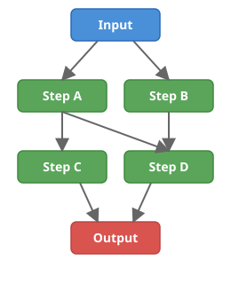
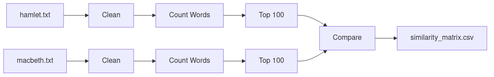
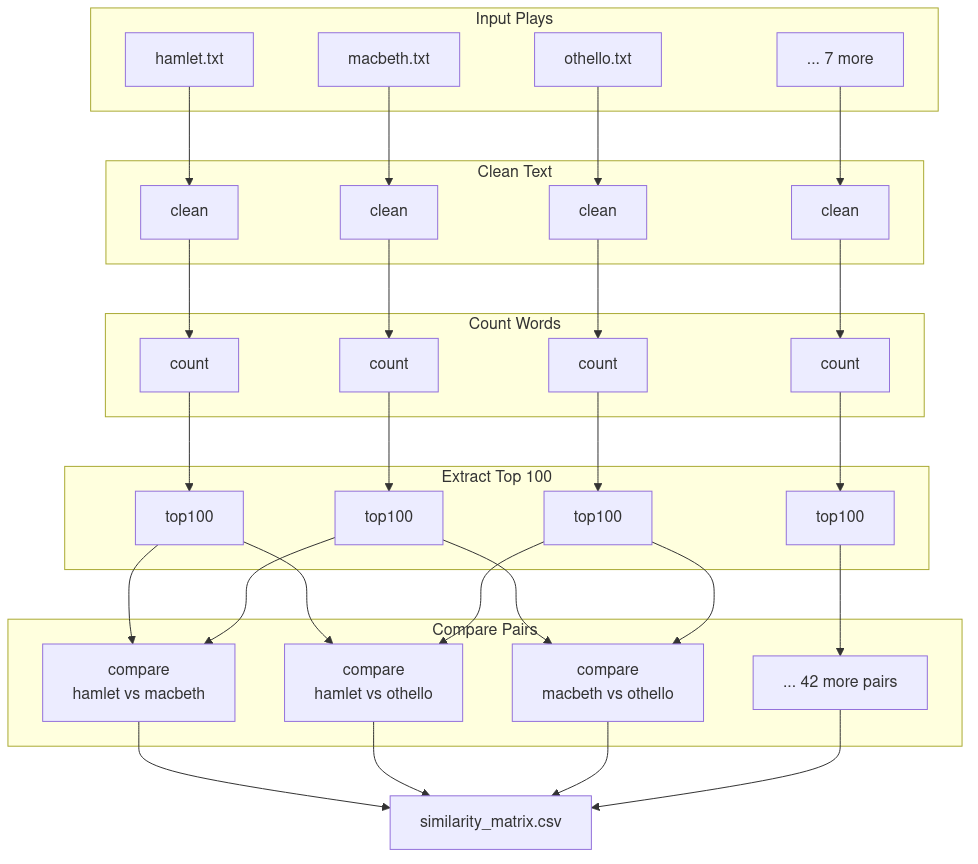
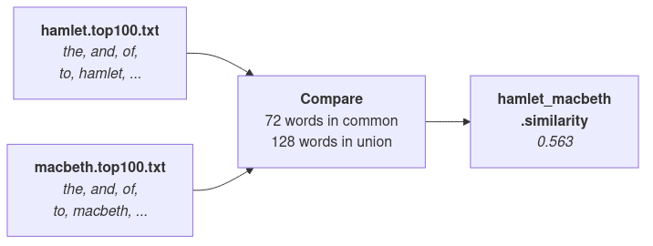
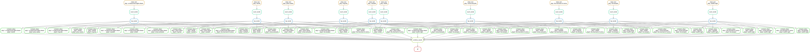

<style>
@import url('https://fonts.googleapis.com/css2?family=Roboto+Slab:wght@400;700&display=swap');
.columns { display: flex; gap: 1em; }
.columns > div { flex: 1; }
section h1, section h2, section h3 { font-family: 'Roboto Slab', serif; }
img[alt~="center"] { display: block; margin: 0 auto; }
header {
  font-family: 'Roboto Slab', serif;
  color: #999;
  font-size: 0.6em;
  width: 100%;
  text-align: right;
  left: 0;
  right: 0;
  padding: 20px 60px 20px 30px;
  box-sizing: border-box;
}
footer {
  font-family: 'Roboto Slab', serif;
  color: #999;
  font-size: 0.6em;
  width: 100%;
  text-align: center;
  left: 0;
  right: 0;
  padding: 0 30px 0px 30px;
  box-sizing: border-box;
}
section::after { font-family: 'Roboto Slab', serif; }
section.lead h1 { font-size: 2.4em; }
section::before {
  content: '';
  background-image: url('images/ycrc-logo-white.png');
  background-size: contain;
  background-repeat: no-repeat;
  position: absolute;
  bottom: 20px;
  left: 30px;
  width: 100px;
  height: 50px;
}
</style>

# Pipelining Tools for HPC Workflows

## Using Bash, Snakemake and Nextflow

Sam Friedman  
Yale Center for Research Computing

---

# Agenda

- **The Problem**: why pipelines?
- **Pipelining concepts**
- **An example workflow**
- **Bash & Slurm**
- **Snakemake**: turning our example into a Snakemake pipeline
- **Break**: 10minute break
- **Nextflow**: using pipelines from the research community
- **Resources**

---

# Setup

Log in to the cluster and clone the workshop repository:

```bash
git clone https://github.com/ycrc/pipelines-workshop.git
cd pipelines-workshop
ls examples/
```

You will need a terminal and a text editor.  
We recommend an [Open OnDemand](https://docs.ycrc.yale.edu/clusters-at-yale/access/ood/) VS Code session.

---

<!-- _class: lead -->

# The Problem

---

# Your Workflow

<div class="columns">
<div>

- Multiple steps that process input to produce output
- Some steps depend on others completing first
- It works: now you need to run it many times, scale it up, or share it

</div>
<div>

```bash
# step 1: process raw data
./clean.sh raw.dat > clean.dat

# step 2: run analysis
./analyze.sh clean.dat > results.dat

# step 3: make figures
./plot.sh results.dat > fig.png
```

</div>
</div>

---

# What Can Go Wrong

- Script versions multiply
- Data folders accumulate
- "It worked on my machine"
- A step fails halfway: is the output valid?

---

# Today's Learning Goals

- Understand key concepts for constructing data pipelines
- Build a simple workflow using bash scripts and Slurm
- Translate that workflow into a Snakemake pipeline
- Run a community-maintained pipeline using Nextflow and nf-core
---

<!-- _class: lead -->

# Pipelining Concepts

---


# Flowcharts and DAGs

<div class="columns">
<div>

- A workflow is a **directed acyclic graph** (DAG)
- Nodes are tasks, edges are dependencies
- No cycles: a task can't depend on its own output

</div>
<div>



</div>
</div>

---

# Atomicity

- Every step of a pipeline should be **atomic**: it either fully succeeds, or fully fails.
- If a step fails, it should not produce partial output
- Prevents downstream steps from running on bad data

---

# Reproducibility

- **Same input** + **same options** = **same output**
- Portable: works the same on any system
- Version control your pipeline, not just your analysis
- Pipelining tools have features to log exactly what processing was run in what order, with what parameters.

---


<!-- _class: lead -->

# Our Example Workflow

---

# The Input Data

- 10 plays by William Shakespeare
- UTF-8 plaintext files
- Stand-in for your real data: genomic reads, simulation output, etc.
- Small enough to run in a workshop, but the tools scale

# The Goal

- Compute a measure of similarity between each pair of plays based on their most common words.
---

# The Workflow

1. **Clean** each play (lowercase, remove punctuation)
2. **Count** word frequencies
3. **Extract** top 100 words per play
4. **Compare** every pair of plays (Jaccard similarity)
5. **Combine** into a similarity matrix CSV

---

# The DAG (Simplified)

For two plays, the workflow looks like this:



---

# The DAG (Full)

With all 10 plays, the DAG fans out: 45 compare steps:




---

# The Bash Scripts


Our original scripts are found in the workshop repository under `examples/bash/`: 

| Script                  | Purpose                                  |
| ----------------------- | ---------------------------------------- |
| `01_analyze_play.sh`    | Clean text, count words, extract top 100 |
| `02_compare_plays.sh`   | Jaccard similarity between two plays     |
| `03_combine_results.sh` | Aggregate results into CSV               |
| `00_run_all.sh`         | Run everything in order                  |

---

# 01_analyze_play.sh

Takes one play, produces its top 100 most frequent words:

**clean text** → **count words** → **extract top 100**


---

# 02_compare_plays.sh

Takes two plays, computes **Jaccard similarity** of their top-100 word sets:

Jaccard = |intersection| / |union|



---

# 03_combine_results.sh

Loops through all `.similarity` files, builds a final CSV: `output/similarity_matrix.csv`

---

# 00_run_all.sh: The Orchestrator

```bash
# Step 1: Analyze all plays
for play in data/*.txt; do
    name=$(basename "$play" .txt)
    ./analyze_play.sh "$name"
done

# Step 2: Compare all pairs
plays=(data/*.txt)
for ((i=0; i<${#plays[@]}; i++)); do
    for ((j=i+1; j<${#plays[@]}; j++)); do
        ./compare_plays.sh "$name1" "$name2"
    done
done

# Step 3: Combine results
./combine_results.sh
```

---

# What's Wrong With This?

- Runs everything **serially**: no parallelism
- No **dependency tracking**: if one step fails, downstream runs anyway
- No **checkpointing**: must restart from scratch on failure
- **Manual cleanup** of intermediate files

---

# Hands-On: Run the Bash Pipeline

1. `cd examples/bash`
2. `bash run_pipeline.sh`
3. Check `output/similarity_matrix.csv`
4. Simulate a data change: `echo "change" >> ../data/hamlet.txt`
5. Re-run: `bash run_pipeline.sh`
6. Notice the **entire** pipeline runs again: even the 9 unchanged plays

This naïve approach to our pipeline has obvious drawbacks...

---

# Moving to Slurm

Our script works, but we're running it on the login node.   
For a real workflow, we commonly:

- **Request dedicated resources**: CPU, memory, time
- **Run in the background**: submit the job and come back later
- **Get notified**: email when the job finishes or fails

We can wrap `00_run_all.sh` in a Slurm job script with `#SBATCH` directives. This is better, but still a single serial job: no parallelism.

---

<!-- _class: lead -->

# Snakemake

---


# What is Snakemake?

- Python-based workflow management tool
- Define **rules** with inputs, outputs, and commands that produce output from input.
- Snakemake builds the DAG and runs tasks in the right order.
- Snakemake allows you to run shell code, or Python code in your scripts.

---

# Key Concepts

- **Snakefile**: The main file that defines the workflow
- **Rules**: Define a single step in the pipeline
  - Has an `input`, `output`, and a `shell` element.
- **Wildcards**: Create input lists from filename patterns

---

# The Default Target: `rule all`

Snakemake works **backwards** from a target. `rule all` declares what the pipeline should produce:

```python
rule all:
    input:
        "output/similarity_matrix.csv"
```

- This is always the **first rule** in the Snakefile
- Snakemake traces dependencies backwards to figure out what needs to run
- Nothing runs unless it's needed to produce this target

---

# Translating: Clean Text

<div class="columns">
<div>

**Bash**

```bash
cat "$INPUT" \
  | tr '[:upper:]' '[:lower:]' \
  | tr -d '[:punct:]' \
  | tr -s '[:space:]' '\n' \
  > output/${PLAY}.clean.txt
```

</div>
<div>

**Snakemake**

```python
rule clean_text:
    input:
        "data/{play}.txt"
    output:
        temp("output/{play}.clean.txt")
    shell:
        """
        cat {input} \
          | tr '[:upper:]' '[:lower:]' \
          | tr -d '[:punct:]' \
          | tr -s '[:space:]' '\\n' \
          > {output}
        """
```

</div>
</div>

- `{play}` is a **wildcard**: one rule handles all 10 plays
- `temp()` marks the file for automatic cleanup

---

# Translating: Count Words

<div class="columns">
<div>

**Bash**

```bash
cat output/${PLAY}.clean.txt \
  | sort \
  | uniq -c \
  | sort -rn \
  > output/${PLAY}.counts.txt
```

</div>
<div>

**Snakemake**

```python
rule count_words:
    input:
        "output/{play}.clean.txt"
    output:
        temp("output/{play}.counts.txt")
    shell:
        """
        sort {input} \
          | uniq -c \
          | sort -rn > {output}
        """
```

</div>
</div>

- Snakemake knows `count_words` depends on `clean_text` because the **output of one matches the input of the other**

---

# Translating: Top 100 Words

<div class="columns">
<div>

**Bash**

```bash
head -100 \
  output/${PLAY}.counts.txt \
  > output/${PLAY}.top100.txt

rm output/${PLAY}.clean.txt
rm output/${PLAY}.counts.txt
```

</div>
<div>

**Snakemake**

```python
rule top_words:
    input:
        "output/{play}.counts.txt"
    output:
        "output/{play}.top100.txt"
    shell:
        """
        head -100 {input} > {output}
        """
```

</div>
</div>

- No manual `rm` needed: `temp()` files are deleted after all rules that need them have finished
- `top100.txt` is **not** `temp()` because it's a final deliverable we want to keep

---

# Translating: Compare Plays

<div class="columns">
<div>

**Bash**

```bash
comm -12 \
  <(awk '{print $2}' "$FILE1" \
    | sort) \
  <(awk '{print $2}' "$FILE2" \
    | sort) \
  > output/common.txt
# ... compute Jaccard ...
```

</div>
<div>

**Snakemake**

```python
rule compare_plays:
    input:
        top1="output/{play1}.top100.txt",
        top2="output/{play2}.top100.txt"
    output:
        "output/{play1}_{play2}.similarity"
    shell:
        """
        COMMON=$(comm -12 \
          <(awk '{{print $2}}' \
            {input.top1} | sort) \
          <(awk '{{print $2}}' \
            {input.top2} | sort) \
          | wc -l)
        ...
        """
```

</div>
</div>

- Two wildcards `{play1}` and `{play2}` handle all 45 pairs

---

# Translating: Combine Results

This rule needs to know about **all** pair combinations upfront. We build the list at the top of the Snakefile:

```python
# At the top of the Snakefile:
(PLAYS,) = glob_wildcards("data/{play}.txt")
PAIRS = []
for i, p1 in enumerate(PLAYS):
    for p2 in PLAYS[i + 1 :]:
        PAIRS.append((p1, p2))
```
- The loop generates all 45 pairs of input files automatically

---

# Translating: Combine Results

```python
rule combine_results:
    input:
        [f"output/{p1}_{p2}.similarity"
         for p1, p2 in PAIRS]
    output:
        "output/similarity_matrix.csv"
    shell:
        """
        echo "play1,play2,similarity" > {output}
        for file in {input}; do
          # parse filename, append row
        done
        """
```


---

# Running Snakemake
When executing `snakemake`, it will find a `Snakefile` in the current directory.
- `snakemake -n` for a dry run
- `snakemake` to execute the pipeline
- `snakemake --dag | dot -Tpng > dag.png` to visualize

---

# The Snakemake DAG

`snakemake --dag | dot -Tpng > dag.png`



---

# The Snakemake DAG (Zoomed In)

A look at Macbeth/Othello:


---

# What You Get "For Free"

- DAG visualization
- Automatic dependency resolution
- Only re-runs steps whose inputs changed
- Parallel (multiple processes) execution with `-j`
- Dry-run mode

---

# Snakemake on Slurm

- `--executor slurm`: each rule becomes a separate Slurm job
- Snakemake monitors and schedules automatically

```bash
snakemake -j4 --executor slurm \
  --default-resources slurm_partition=day mem_mb=1000 cpus_per_task=1
```

**Note**: If running Snakemake from a Python environment, make sure you install `snakemake-executor-plugin-slurm`.

---

# Keeping Small Steps Local

Not every rule needs its own Slurm job. Use `localrules` to run lightweight steps on the head node:

```python
localrules: all, combine_results

rule all:
    input: "output/similarity_matrix.csv"

rule combine_results:
    ...
```

- Everything else still gets submitted to Slurm via `--executor slurm`

---

# Custom Resources Per Rule

Different steps have different needs. Use `resources:` to request more for heavy rules:

```python
rule star_align:
    input: "reads/{sample}.fastq"
    output: "aligned/{sample}.bam"
    threads: 8
    resources:
        mem_mb=32000,
        runtime=60             # minutes
    shell: "STAR --runThreadN {threads} ..."
```

- `threads:` sets `--cpus-per-task` in the Slurm job
- `resources:` sets memory, runtime, and other Slurm directives
- `--default-resources` on the command line applies to rules that don't specify their own

---

# Python Scripts

Use `script:` to call a Python script. Snakemake passes inputs/outputs automatically:

<div class="columns">
<div>

**Snakefile**

```python
rule plot_results:
    input:
        "output/similarity_matrix.csv"
    output:
        "output/heatmap.png"
    script:
        "scripts/plot_heatmap.py"
```

</div>
<div>

**scripts/plot_heatmap.py**

```python
import pandas as pd
import matplotlib.pyplot as plt

df = pd.read_csv(snakemake.input[0])
# ... build heatmap ...
plt.savefig(snakemake.output[0])
```

</div>
</div>

---

# R Scripts

Same pattern for R: Snakemake provides a `snakemake@` object:

<div class="columns">
<div>

**Snakefile**

```python
rule fit_model:
    input:
        "output/counts.csv"
    output:
        "output/model.rds"
    script:
        "scripts/fit_model.R"
```

</div>
<div>

**scripts/fit_model.R**

```r
counts <- read.csv(snakemake@input[[1]])
# ... fit model ...
saveRDS(model, snakemake@output[[1]])
```

</div>
</div>

`shell:` still works for any command-line tool: MATLAB, Julia, etc.

---

# Containers in Snakemake

Your pipeline needs specific software versions: containers bundle everything so results are reproducible anywhere.

Snakemake supports per-rule `container:` directives:

```python
rule align_reads:
    input: "reads.fastq"
    output: "aligned.bam"
    container: "docker://biocontainers/bwa:0.7.17"
    shell: "bwa mem {input} > {output}"
```

You can also point to a local `.sif` file: `container: "/path/to/bwa.sif"`

On our clusters we use **Apptainer** (not Docker), but Snakemake will convert.

---

# Running Snakemake with Containers

Enable with `--software-deployment-method apptainer` (or `--sdm`):

```bash
snakemake -j4 --sdm apptainer
```

- Snakemake auto-pulls and caches container images
- Each rule runs in its own isolated container
- Our Shakespeare example uses only basic shell tools so no container is needed, but real-world pipelines typically specify one per rule.

---

# Hands-On: Snakemake

1. `cd examples/snakemake` and `module load snakemake`
2. Dry run: `snakemake -n`
3. Execute: `snakemake -j1`
4. Check: `head output/similarity_matrix.csv`
5. Simulate a data change and dry-run: only affected steps re-execute:
   ```bash
   echo "change" >> ../data/hamlet.txt
   snakemake -n   # 14 of 77 jobs will re-run
   ```

---

# Demo: Snakemake on Slurm

A head job orchestrates, submitting each rule as a child Slurm job:

```bash
#!/bin/bash
#SBATCH --partition=devel
#SBATCH --time=00:10:00
#SBATCH --mem=1G
#SBATCH --output=pipeline.out

module load snakemake
snakemake -j2 --executor slurm --latency-wait 30 \
  --default-resources slurm_partition=day \
  mem_mb=1000 cpus_per_task=1 runtime=5
```


---

<!-- _class: lead -->

# Break

10 minutes

---

<!-- _class: lead -->

# Nextflow

---

# What is Nextflow?

- Groovy-based workflow management
- **Processes** and **channels**
- Built-in container support (Docker, Apptainer)
- Dataflow programming model

---

# Key Concepts

- **Processes**: define tasks with inputs, outputs, scripts
- **Channels**: connect processes, data flows through them
- **Operators**: transform and combine channels

---

# Snakemake vs Nextflow

|                         | Snakemake                        | Nextflow                      |
| ----------------------- | -------------------------------- | ----------------------------- |
| **Language**            | Python                           | Groovy                        |
| **Approach**            | File-based (rules produce files) | Dataflow (channels pass data) |
| **Learning curve**      | Lower (Python syntax)            | Higher (Groovy + channels)    |
| **Config**              | Snakefile + config.yaml          | nextflow.config + profiles    |
| **Community pipelines** | Snakemake Catalog                | nf-core                       |

Snakemake is more intuitive, while Nextflow has more features for complex workflows.

---

# Side by Side: clean_text

<div class="columns">
<div>

**Snakemake**
```python
rule clean_text:
    input:
        "data/{play}.txt"
    output:
        temp("output/{play}.clean.txt")
    shell:
        """
        cat {input} \
          | tr '[:upper:]' '[:lower:]' \
          | tr -d '[:punct:]' \
          | tr -s '[:space:]' '\\n' \
          > {output}
        """
```

</div>
<div>

**Nextflow**
```groovy
process clean_text {
    input:
    path play

    output:
    tuple val(play.baseName),
          path("${play.baseName}.clean.txt")

    script:
    """
    cat ${play} \
      | tr '[:upper:]' '[:lower:]' \
      | tr -d '[:punct:]' \
      | tr -s '[:space:]' '\\n' \
      > ${play.baseName}.clean.txt
    """
}
```

</div>
</div>

---

# Nextflow: Channels and Workflow

Where does `path play` come from? The **workflow** block wires it up:

```groovy
// Create a channel from all .txt files
plays_ch = Channel.fromPath("data/*.txt")

workflow {
    cleaned = clean_text(plays_ch)   // each file flows into clean_text
    counted = count_words(cleaned)   // output flows into count_words
    top100  = top_words(counted)     // and so on...
}
```

- A **channel** is a stream of data flowing between processes
- Nextflow automatically parallelizes: 10 files in the channel = 10 concurrent tasks

---

# Hands-On: Nextflow Shakespeare

Our Shakespeare workflow is implemented in Nextflow in `examples/nextflow/shakespeare/`.

```bash
cd examples/nextflow/shakespeare
module load Nextflow
nextflow run main.nf -with-report shakespeare.html
```

When finished, inspect the output files in `output/` and the HTML report `shakespeare.html`.


---

# Nextflow in Practice

Rather than focusing on our Shakespeare workflow, we'll look at the **most common real-world use case**: running an existing, community-maintained pipeline.

- Thousands of researchers use Nextflow this way every day
- Someone has already written, tested, and optimized the pipeline
- You provide your data and configuration: Nextflow does the rest

---

# Nextflow Configuration

Configuration is separate from the pipeline code, in `nextflow.config`:

- **Profiles**: switch between environments (local, Slurm)
- On our cluster, we use the `apptainer` profile for containers

```groovy
// nextflow.config example for Slurm
process {
    executor = 'slurm'
    queue    = 'day'
}
apptainer {
    enabled  = true
    cacheDir = '~/scratch/apptainer_cache'
}
```

---

# Containers in Nextflow

Like Snakemake, Nextflow supports per-process `container` directives:

```groovy
process align_reads {
    container 'docker://biocontainers/bwa:0.7.17'

    input:
    path reads

    output:
    path "aligned.bam"

    script:
    "bwa mem ${reads} > aligned.bam"
}
```

You can also point to a local `.sif` file: `container '/path/to/bwa.sif'`

---

# Running Nextflow with Apptainer

Enable in `nextflow.config` or use a profile:

```bash
nextflow run main.nf -profile apptainer
```

- Nextflow auto-pulls Docker images and converts them to Apptainer format
- Set `cacheDir` to scratch storage — images can be large
- This is already configured when you use `-profile apptainer` with nf-core pipelines

---

# The `work/` Directory

Nextflow stores all intermediate files in `work/`:

```
work/
├── 86/9b3800...    # clean_text (hamlet)
├── 94/d89dc0...    # count_words (hamlet)
├── 6d/5c8b4b...    # top_words (hamlet)
└── ...
```

- Each task gets a unique subdirectory (hash-based)
- Inputs are **symlinked** in, outputs are written here
- `publishDir` copies final results out of `work/` to where you want them
- `work/` can get **very large**: use `nextflow run ... -w ~/scratch/` to put it on scratch storage.

---

# `-resume`: Pick Up Where You Left Off

```bash
nextflow run main.nf -resume
```

- Nextflow checks `work/`: if a task's inputs haven't changed, it **skips** it
- Critical for long pipelines: a failure at step 180 of 194 doesn't mean starting over
- Also useful during development: change one process, re-run, only that step re-executes

**Cleanup** when you're done:

```bash
nextflow clean -f       # delete all work/ contents
```

---

<!-- _class: lead -->

# NF-Core Pipelines

---

# What is nf-core?


- Community of **100+ curated Nextflow pipelines**
- Standardized structure: every pipeline works the same way
- Containerized: all software dependencies bundled
- Tested and documented by active maintainers
- Browse pipelines at https://nf-co.re/pipelines

---

# What is nf-core?


---

# What is nf-core?


---

# Why Use Pre-Built Pipelines?

- **Tested by hundreds of users**: all open-source!
- **Reproducible out of the box**: containers, pinned versions
- **Saves development time**: focus on your science
- **Consistent interface**:

```bash
nextflow run nf-core/<pipeline> -profile test,apptainer --outdir results
```

---

# nf-core/rnaseq

The most widely-used nf-core pipeline: bulk RNA-seq analysis.

**Steps:**
1. **FastQC**: raw read quality check
2. **Trim Galore**: adapter and quality trimming
3. **STAR**: align reads to reference genome
4. **Salmon**: quantify gene expression
5. **MultiQC**: aggregate QC into one report

Test profile uses a tiny yeast dataset (~50K reads).

---

# Nextflow on Slurm: Head Job Pattern

Submit a lightweight batch job that acts as the Nextflow head node. It orchestrates the pipeline and submits each task as a separate Slurm job:

```bash
#!/bin/bash
#SBATCH --partition=day
#SBATCH --time=02:00:00
#SBATCH --cpus-per-task=2
#SBATCH --mem-per-cpu=4G

module load Nextflow/24.10.2
nextflow run nf-core/rnaseq -r 3.14.0 \
    -profile test,apptainer \
    -c nextflow.config --outdir output
```

`sbatch run_rnaseq_slurm.sh` — head job submits child Slurm jobs for each process.

---

# Mixing Local and Slurm Execution

Use `nextflow.config` to route heavy steps to Slurm and keep lightweight steps local:

```groovy
process {
    executor = 'slurm'
    queue = 'day'
    time = '1h'

    // Keep lightweight steps local to avoid queue wait times
    withName: 'MULTIQC|CUSTOM_DUMPSOFTWAREVERSIONS' {
        executor = 'local'
    }
}
```

- `withName:` selects processes by name — use `|` to match multiple
- Small steps run on the head node instantly instead of waiting in the queue

---

# Demo: Running nf-core/rnaseq

```bash
salloc --mem-per-cpu=4G --cpus-per-task=4
nextflow run nf-core/rnaseq -r 3.14.0 -profile test,apptainer --outdir output
```

| Flag                 | Purpose                                |
| -------------------- | -------------------------------------- |
| `nf-core/rnaseq`     | Pull and run the pipeline from nf-core |
| `-r 3.14.0`          | Pin to a specific pipeline version     |
| `-profile test`      | Use built-in test dataset (yeast)      |
| `-profile apptainer` | Use Apptainer containers               |
| `--outdir output`    | Where to write output                  |


---

# Inspecting Output

```
output/
├── multiqc/          # HTML summary report
├── star_salmon/      # Aligned reads + quantification
├── fastqc/           # Per-sample QC reports
├── trimgalore/       # Trimmed reads
└── pipeline_info/    # Execution timeline, versions
```

Open `output/multiqc/multiqc_report.html` for alignment rates, read quality, and gene detection at a glance.

---

# Finding Pipelines for Your Research

Browse https://nf-co.re/pipelines, examples:

| Domain            | Pipeline         |
| ----------------- | ---------------- |
| RNA-seq           | nf-core/rnaseq   |
| Variant calling   | nf-core/sarek    |
| Single-cell       | nf-core/scrnaseq |
| ATAC-seq          | nf-core/atacseq  |
| Amplicon (16S)    | nf-core/ampliseq |
| Fetch public data | nf-core/fetchngs 

---

# Finding Pipelines for Your Research

Snakemake has a pipeline catalog too, https://snakemake.github.io/snakemake-workflow-catalog:

| Domain            | Pipeline         |
| ----------------- | ---------------- |
| RNA-seq           | rna-seq-star-deseq2   |
| Variant calling   | dna-seq-gatk-variant-calling    |
| Single-cell       | epigen/scrnaseq_processing_seurat |
| ATAC-seq          | epigen/atacseq_pipeline  |
| Amplicon (16S)    | cmc-aau/nanopore_16Samp |
| Fetch public data | epigen/fetch_ngs

---

# Resources & Next Steps

- [nf-core documentation](https://nf-co.re/docs/usage/getting_started/introduction)
- [Nextflow training](https://training.nextflow.io/)
- [Snakemake documentation](https://snakemake.readthedocs.io/)
- [Yale HPC documentation](https://docs.ycrc.yale.edu/) and office hours

---

<!-- _footer: "" -->

# Workshop Feedback

Please help us improve this workshop by sharing feedback via a 2-minute anonymous survey. Thank you.

For access: click the link or scan the QR Code:
https://yalesurvey.ca1.qualtrics.com/jfe/form/SV_ac86jTriewu9l8W

 

---

<!-- _class: lead -->

# Questions?

Thank you!

Any remaining time can be used for additional questions and office hours.
